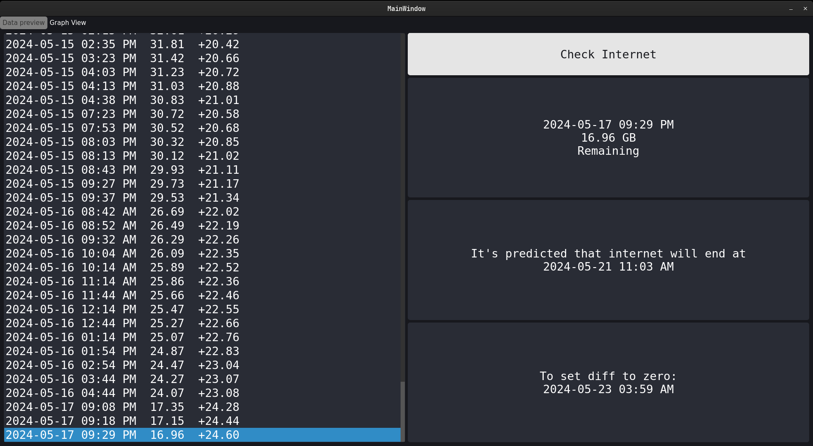
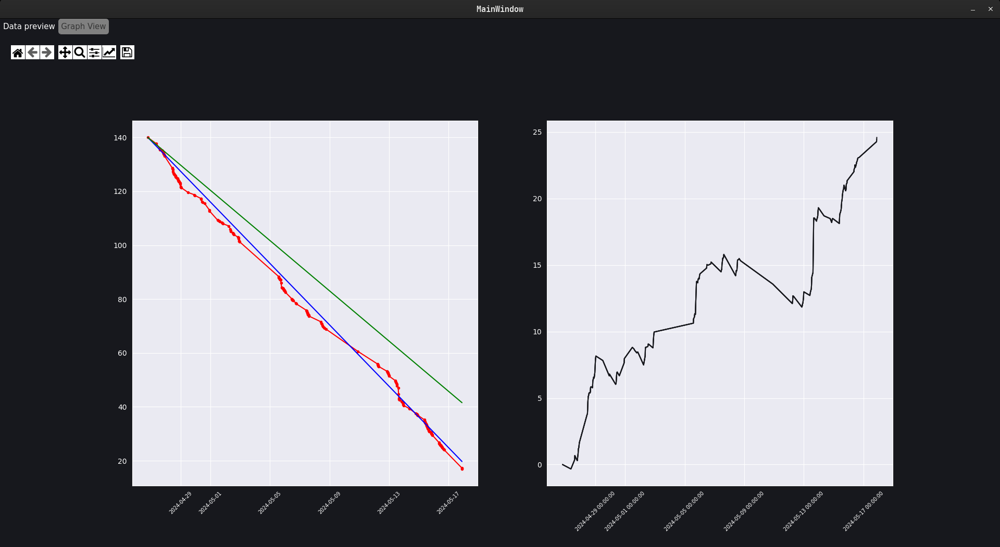

# MyWe-Scraper

MyWe-Scraper is a Python-based tool designed to interact with the MyWe service to fetch and track your usage data. This project sends requests to the MyWe servers to obtain your remaining data quota, saves this data locally, and plots your usage over time.

Additionally, the program comes with a very beautiful interface for ease of use.

## Features

- Sends requests to MyWe servers to fetch user quota data
- Parses and extracts relevant information from the responses
- Stores the data locally in a structured format
- Plots your data usage over time for easy monitoring
- Utilizes machine learning to learn from your data and predict when your internet quota will end
- Comes with a tray icon for easy access and quick monitoring

- Configurable and extendable

## Screenshots

Here are some screenshots of MyWe-Scraper in action:

1. *Main Interface*:
   

2. *Data Plot*:
   


## Requirements

- Python 3.6+
- `requests` library
- `matplotlib` library
- `pandas` library

## Installation

1. Clone the repository:
   ```bash
   git clone https://github.com/MarwanMagdy0/MyWe-Scraper.git
    ```
2. Run the scraper
```bash
python main.py
```
## Configuration

1. Create a user_data.json file in the root directory of the project with your MyWe credentials:
    ```json
    {
    "msisdn": "telephone-number",
    "password": "password"
    }
    ```

## License

This project is licensed under the MIT License. See the [LICENSE](LICENSE) file for details.